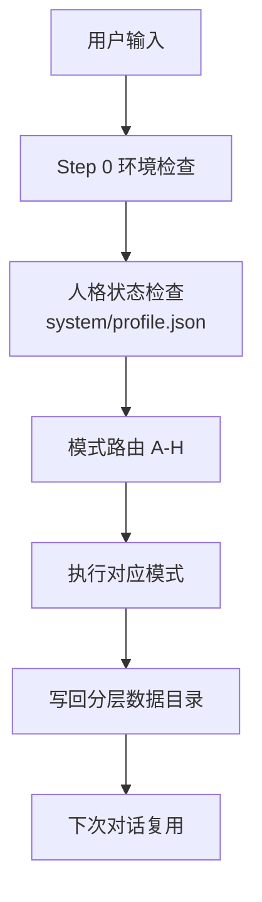
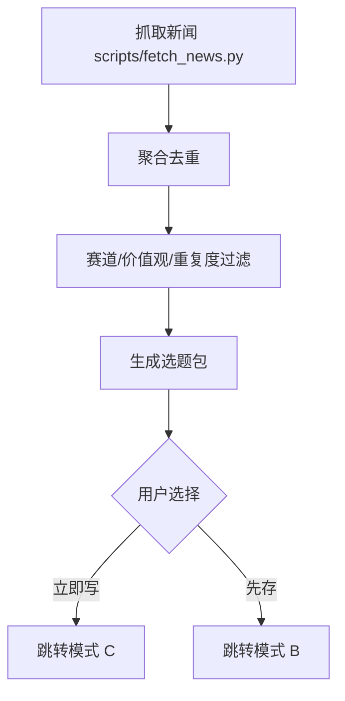
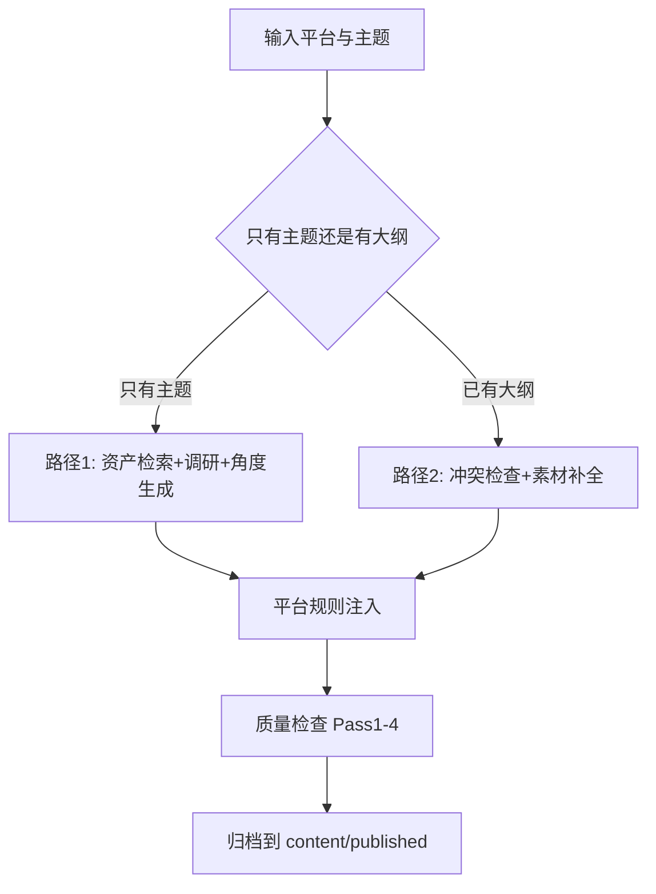
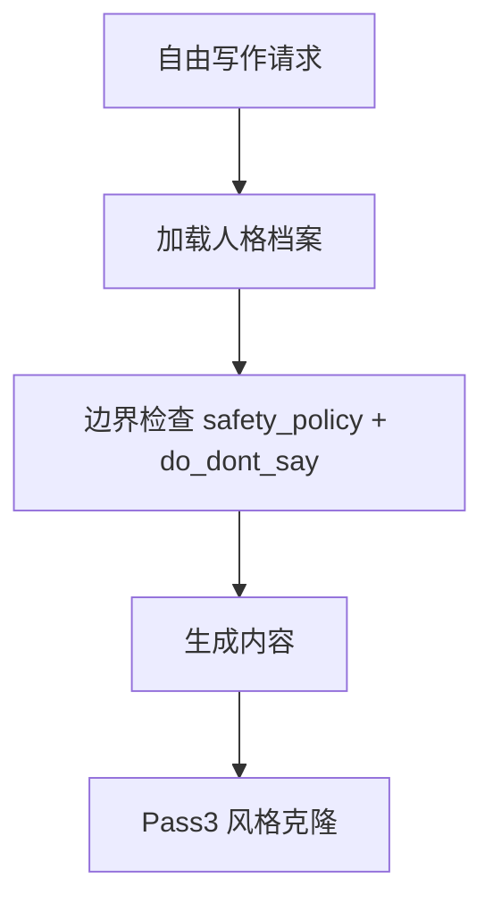
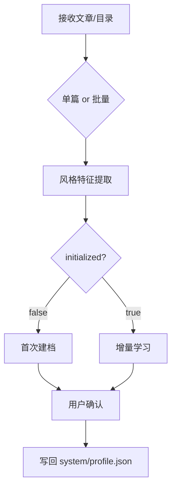
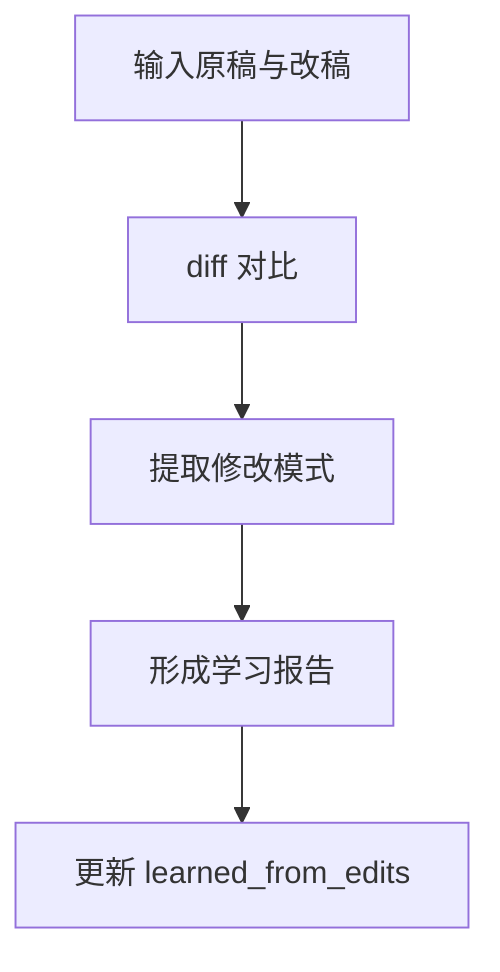
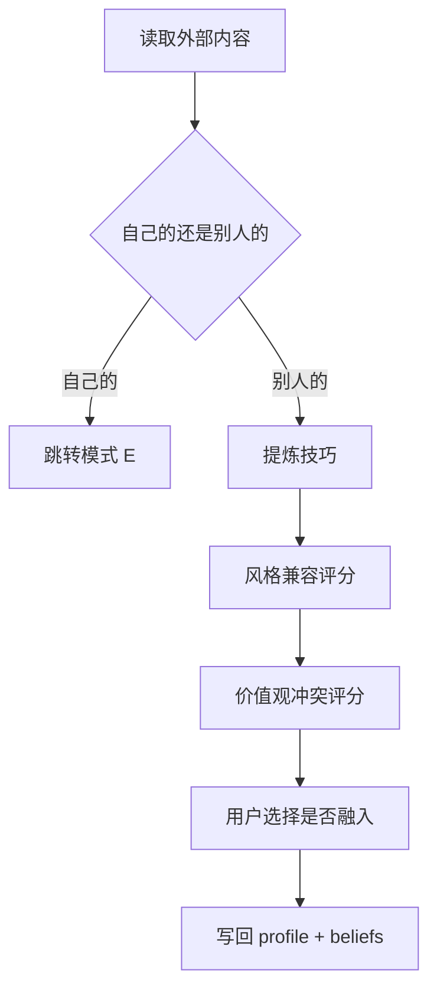
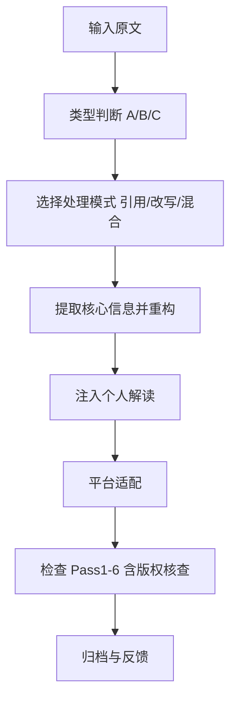

# creator-digital-twin

个人创作数字分身技能（v1.0）。  
目标是把你的创作变成一个长期可进化系统：会写、会学、会记、会复盘。

## 1. 快速开始

### 安装

```bash
npx skills add <your-org-or-name>/<repo>@creator-digital-twin -y
```

### 首次运行

1. 初始化目录：`bash scripts/init.sh`
2. 旧版升级（如有）：`python scripts/migrate_v3_to_v4.py`
3. 做一次风格学习（模式 E）：提供 3-5 篇你满意的历史文章

### 总流程图



## 2. 一句话触发示例

| 你对助手说 | 触发模式 | 结果 |
|---|---|---|
| 学习我的风格，文章在 `E:\\my_articles` | E | 更新 `system/profile.json` |
| 今天有什么 AI 新闻，给我 3 个能写的题 | A | 返回选题包 |
| 记个点子：AI Agent 在客服中的坑 | B | 写入 `assets/ideas/ideas.json` |
| 发一篇小红书，主题 AI 自动化入门 | C | 产出平台适配稿件 |
| 随便写一段我的周复盘 | D | 自由创作并过边界检查 |
| 我改完了，学习我的改动 | F | 更新偏好规则 |
| 学习这篇外部文章的方法论：`https://...` | G | 提炼技巧并评估兼容性 |
| 把这篇文章改成我的风格发公众号 | H | 改写+版权核查 |

## 3. 分层数据结构

运行后在项目内维护 `./.writing-style/`：

- `system/`：主档案、路由、安全策略
- `memory/`：长期记忆（事件、观点、故事）
- `persona/`：语气、说法边界、立场
- `content/`：草稿、发布稿、二创稿
- `assets/`：点子、概念、金句、案例
- `analytics/`：表现数据、复盘、策略更新
- `news_sources/`：新闻抓取与去重状态

## 4. 模式详解与逻辑图

### 模式 A：新闻雷达（AI News Radar）

- 适用：你要找“今天写什么”
- 输入：新闻需求、关注赛道
- 输出：可创作选题包（角度+平台建议）



### 模式 B：资产与记忆管理（Asset & Memory）

- 适用：记点子、存概念、存金句、记经历
- 输入：一句灵感或一段经验
- 输出：结构化写入 `assets/` 或 `memory/`

```mermaid
flowchart TD
    B1[接收输入] --> B2{类型识别}
    B2 -->|点子| B3[assets/ideas]
    B2 -->|概念/金句/案例| B4[assets/concepts|quotes|cases]
    B2 -->|经历/观点变化| B5[memory/stories|beliefs|timeline]
    B3 --> B6[更新索引]
    B4 --> B6
    B5 --> B6
```

### 模式 C：平台写作（Platform Writing）

- 适用：明确要发某平台内容
- 输入：主题或大纲 + 平台
- 输出：平台可发布稿件 + 质量检查结果



### 模式 D：自由创作（Free Writing）

- 适用：不限定平台，自由表达
- 输入：任意创作意图
- 输出：符合人格语气的自由稿



### 模式 E：风格学习（Style Learning）

- 适用：第一次建分身或更新风格
- 输入：单篇文章或文章目录
- 输出：更新后的 `system/profile.json`



### 模式 F：实时学习（Edit-based Learning）

- 适用：你修改了 AI 稿件后让它学习
- 输入：原稿 + 你的修改稿
- 输出：你的改写偏好规则



### 模式 G：外部材料学习（External Learning）

- 适用：学习别人的方法论但不盲目照搬
- 输入：链接/文档
- 输出：可选技巧清单 + 兼容性判断



### 模式 H：内容改写包装（Rewrite & Repackage）

- 适用：把外部内容改成你的表达风格并发布
- 输入：原文链接/文本 + 目标平台
- 输出：改写稿 + 版权风险报告



## 5. 常见对话模板（可直接复制）

| 目标 | 你可以直接说 |
|---|---|
| 建立分身 | 学习我的风格，目录在 `E:\\xxx\\articles`，请更新我的 profile |
| 选题策划 | 给我今天 AI 方向最值得写的 3 个选题，并推荐平台 |
| 平台写作 | 发一篇公众号：主题是“AI 工作流”，先给我 3 个角度再写 |
| 复盘学习 | 我修改了这篇文章，帮我学习我的修改偏好 |
| 外部学习 | 学习这篇文章的方法论，但先评估是否和我的风格冲突 |
| 改写发布 | 把这个链接改写成我的风格，发小红书，先做版权检查 |

## 6. 发布到 GitHub 前检查

1. `SKILL.md` frontmatter 只保留 `name` 和 `description`
2. 无 `__pycache__/` 与 `*.pyc`
3. 关键脚本可运行或至少可解析
4. `references/` 内链接路径有效
5. 用一次完整对话测试 A/B/C/E/F/G/H 至少各 1 次
