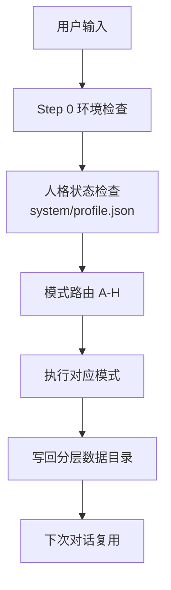
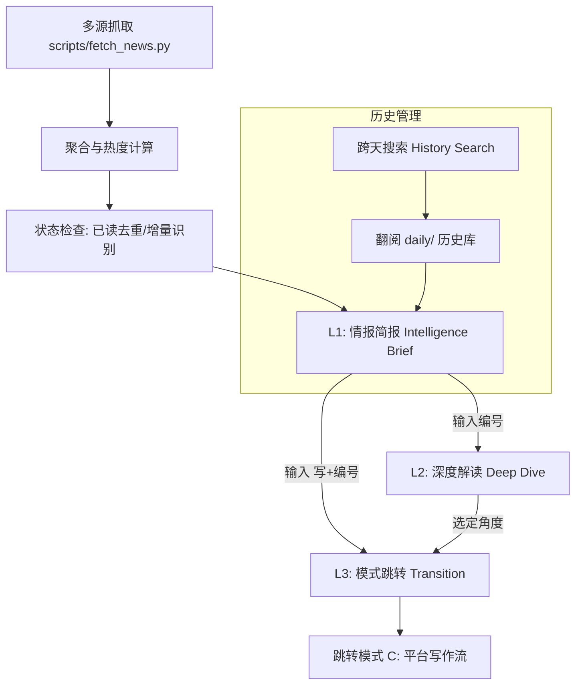
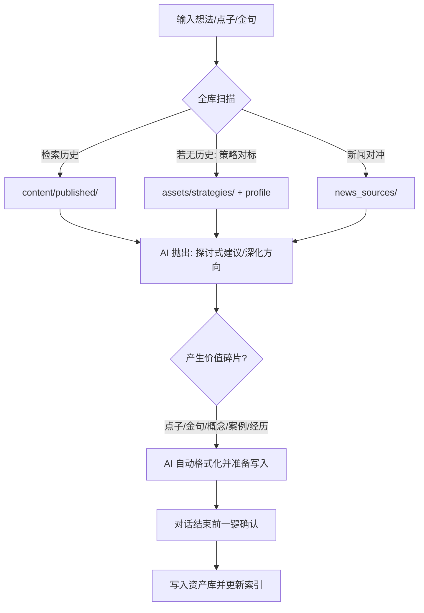
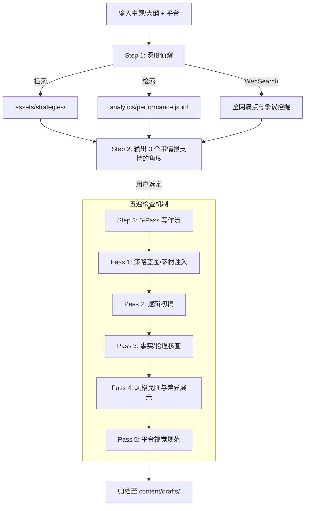
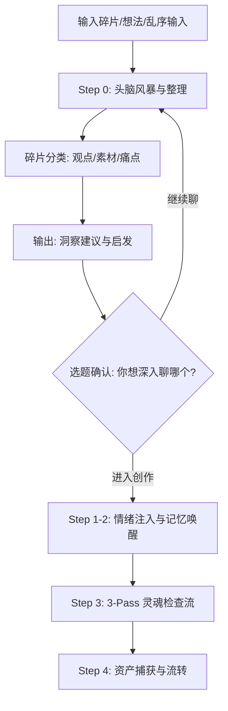
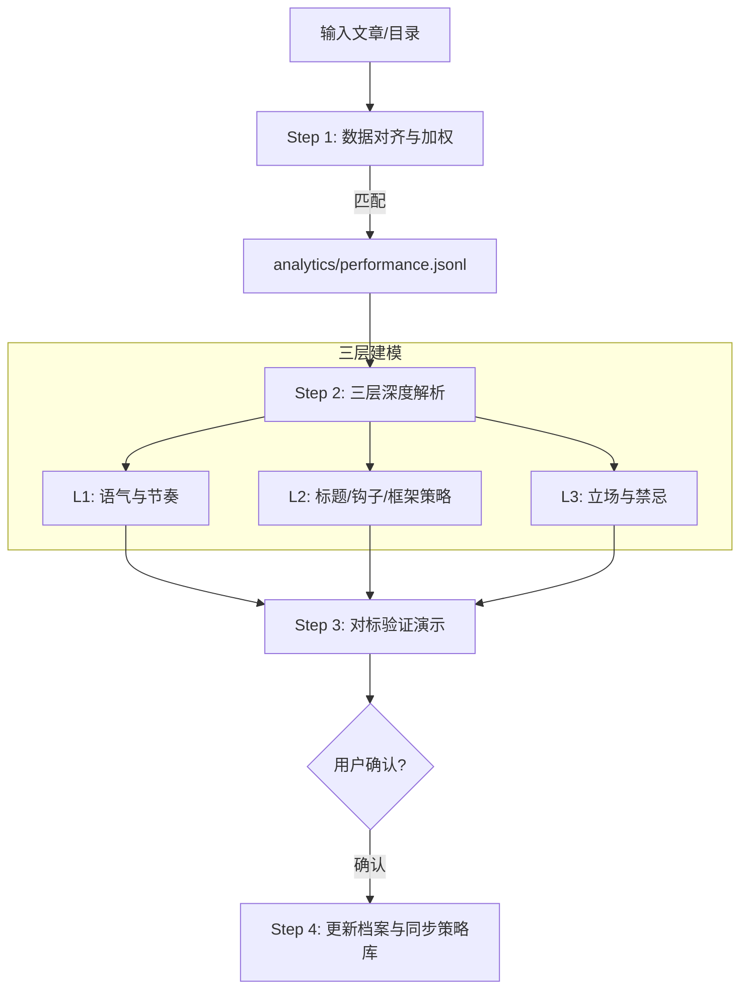
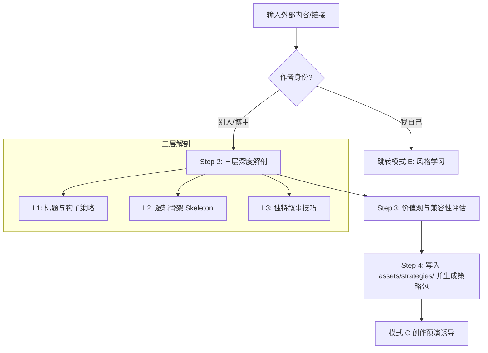
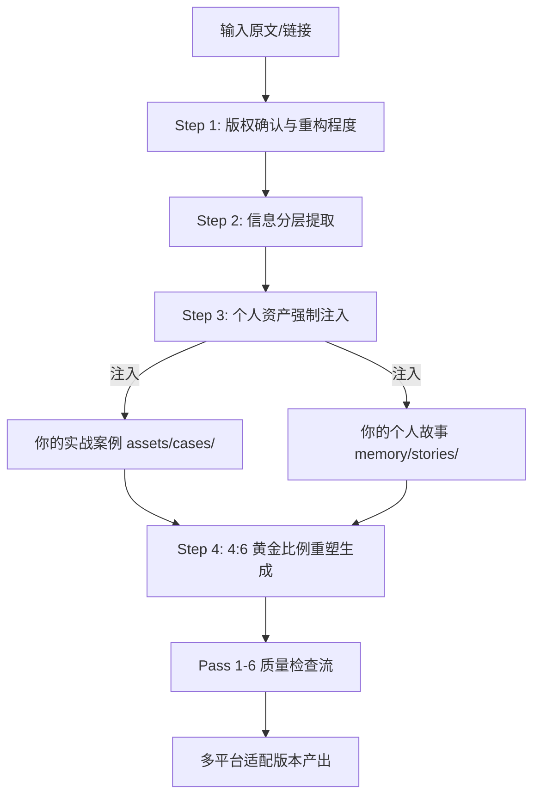
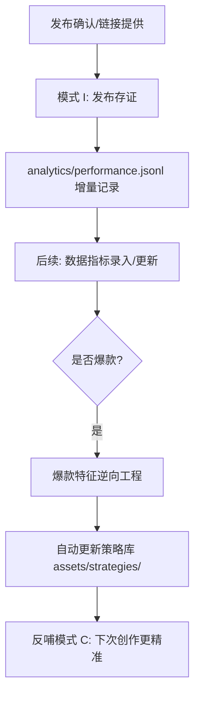

# creator-digital-twin

个人创作数字分身技能（v1.0）。  
目标是把你的创作变成一个长期可进化系统：会写、会学、会记、会复盘。

## 1. 快速开始

### 安装

```bash
npx skills add xhanzo-coder/creator-digital-twin-skill@creator-digital-twin -y
```

### 首次运行

1. 初始化目录：`bash scripts/init.sh`
2. 旧版升级（如有）：`python scripts/migrate_v3_to_v4.py`
3. 做一次风格学习（模式 E）：提供 3-5 篇你满意的历史文章

### 总流程图



## 2. 一句话触发示例

| 你对助手说 | 触发模式 | 结果 |
|---|---|---|
| 学习我的风格，文章在 `E:\\my_articles` | E | 更新 `system/profile.json` |
| 今天有什么 AI 新闻，给我 3 个能写的题 | A | 返回选题包 |
| 记个点子：AI Agent 在客服中的坑 | B | 写入 `assets/ideas/ideas.json` |
| 发一篇小红书，主题 AI 自动化入门 | C | 产出平台适配稿件 |
| 随便写一段我的周复盘 | D | 自由创作并过边界检查 |
| 我改完了，学习我的改动 | F | 更新偏好规则 |
| 学习这篇外部文章的方法论：`https://...` | G | 提炼技巧并评估兼容性 |
| 把这篇文章改成我的风格发公众号 | H | 改写+版权核查 |

## 3. 分层数据结构

运行后在项目内维护 `./.writing-style/`：

- `system/`：主档案、路由、安全策略
- `memory/`：长期记忆（事件、观点、故事）
- `persona/`：语气、说法边界、立场
- `content/`：草稿、发布稿、二创稿
- `assets/`：点子、概念、金句、案例
- `analytics/`：表现数据、复盘、策略更新
- `news_sources/`：新闻抓取与去重状态

## 4. 模式详解与逻辑图

### 模式 A：新闻雷达（AI News Radar）

- **核心定位**：你的 24 小时 AI 情报员。不只是搬运新闻，而是基于你的“分身”视角进行**价值过滤**与**创作切入**。
- **逻辑进化**：采用 **L1(简报) -> L2(深度) -> L3(创作)** 三段式递进，拒绝信息过载。
- **核心特性**：
  - **🔥 热度感知**：自动识别 12 个信源中的爆款趋势。
  - **🚫 智能去重**：基于 `state.json` 自动剔除已读内容，支持增量更新提醒。
  - **📅 日期锚点**：严格锁定用户指定日期的资讯，支持 24h 实时追踪。
  - **📚 跨天搜索**：支持对数月前的历史情报进行关键词检索与二次创作。



**交互示例**：
- `今天有什么 AI 新闻？` -> 触发 L1 简报（带价值点与初步角度）。
- `详细说说 3` -> 触发 L2 深度（抓取全文、提炼金句、生成 3 个精准切入点）。
- `写 3` 或 `用角度 A 发小红书` -> 触发 L3 自动打包素材并进入 **模式 C** 正式写作。
- `帮我搜搜上周关于 OpenAI 的新闻` -> 触发历史检索模式。

### 模式 B：资产与记忆管理 (Asset & Memory Co-creation)

- **核心定位**：数字分身的“外挂大脑”。不再是被动记录，而是通过**“灵感对撞”**将碎片点子转化为结构化资产。
- **逻辑进化**：引入 **多维扫描 (Scanning) -> 对话共创 (Co-creation) -> 隐式捕捉 (Capture)** 流程。
- **核心特性**：
  - **🚀 冷启动友好**：即便无历史文章，也能自动调取学习过的方法论（如 `dontbesilent` 框架）进行对标讨论。
  - **🧠 实时对冲**：自动关联最近 7 天的爆款新闻（模式 A），寻找时政热点与灵感的结合点。
  - **🖋️ 隐式捕捉**：在对话探讨中自动识别金句、概念、案例，无需明确下令“记录”。
  - **🔗 强关联索引**：存入时自动绑定相关的策略、立场和新闻，实现资产的“活化”。



**资产分类说明**：

| 类型 | 存储位置 | 作用 |
| :--- | :--- | :--- |
| **点子 (Ideas)** | `assets/ideas/` | 尚未成熟的选题、灵感片段、未来计划 |
| **概念 (Concepts)** | `assets/concepts/` | 你独特的定义、方法论名词（如“生产型兴趣”） |
| **金句 (Quotes)** | `assets/quotes/` | 具有穿透力的短句、对话中蹦出的精彩表达 |
| **案例 (Cases)** | `assets/cases/` | 具体的例子、调研数据、成功/失败的事实 |
| **经历 (Stories)** | `memory/stories.jsonl` | 个人故事、情绪、具体发生的事件 |
| **观点 (Beliefs)** | `memory/beliefs.json` | 价值观的声明、对某事的深度看法 |

**交互示例**：
- `我觉得 AI 以后不是工具，是数字员工` -> AI 识别为观点，并关联相关新闻，引导你深化成金句或文章大纲。
- `刚才经历了一次很不爽的沟通...` -> AI 识别为经历（Stories），帮你提炼出人际沟通的方法论（Concepts）。
- `记个点子：用 AI 做个人知识库的 7 个坑` -> AI 对标你的写作风格，建议你发小红书并提供初步大纲。

### 模式 C：平台策略写作 (Strategy-Driven Writing)

- **核心定位**：基于**“策略对标”**与**“深度痛点挖掘”**的高质量内容工厂。
- **流程进化**：引入 **策略锚点 (Anchoring) -> 痛点挖掘 (Research) -> 5-Pass 质量控制**。
- **核心特性**：
  - **📁 策略对标**：强制调取 `assets/strategies/`（如 `dontbesilent` 框架）和历史爆款指标。
  - **🔍 深度挖掘**：全网检索话题误区、争议点及新手痛点，拒绝陈词滥调。
  - **💎 素材注入**：动笔前先展示金句、案例和痛点清单。
  - **🎨 可视化克隆**：**Pass 4** 强制展示从“AI 腔”到“分身语气”的修改过程。



**交互示例**：
- `写个关于 AI 工作流的小红书` -> AI 检索痛点后建议你写“省钱方案”并展示 `dontbesilent` 的结构。
- `帮我把这个大纲写成公众号` -> AI 自动补全金句并展示 Pass 4 的风格优化过程。

### 模式 D：头脑风暴与灵魂随笔 (Brainstorming & Soul Flow)

- **核心定位**：你的**灵感收纳盒**与**头脑风暴伙伴**。
- **逻辑进化**：引入 **碎片分类 (Sort) -> 深度建议 (Suggest) -> 选题引导 (Topic Hook) -> 灵魂随笔**。
- **核心特性**：
  - **🧩 灵感整理**：你丢出一堆碎片，AI 帮你分类（观点、素材、痛点），一目了然。
  - **💡 启发式建议**：AI 主动抛出 2-3 个洞察点，帮你把小想法变成大策划。
  - **📌 选题钩子**：整理完逻辑后，AI 会主动问你“哪个做成选题？”，引导进入创作闭环。
  - **🎭 灵魂随笔**：确认方向后，执行记忆唤醒与“三遍灵魂检查”进行创作。



**交互示例**：
- `帮我理一下，最近对 AI 硬件和可穿戴设备有些乱七八糟的想法...` -> AI 分类整理碎片，给出 3 个独特的切入建议，并问你哪个想写成文。
- `随便写点对 AI 未来的担忧` -> AI 唤醒记忆，生成带你个人风格的深度随笔。

### 模式 E：数据驱动风格学习 (Data-Driven Style Learning)

- **核心定位**：数字分身的“基因工程中心”。通过分析历史文章，提取并加权你的语气、策略与价值观。
- **逻辑进化**：引入 **数据加权 (Weighting) -> 三层解析 (Triple-Parsing) -> 对标验证 (Verification)**。
- **核心特性**：
  - **📈 数据加权**：优先学习点赞/转发 Top 10% 的爆款文章，避开平庸模式。
  - **🧬 三层解析**：从语言（语气/节奏）、策略（标题/钩子/框架）、灵魂（立场/禁忌）三个维度建模。
  - **🎭 对标验证**：学完后立即现场展示“去 AI 化”改写，确保学习效果可见、可控。
  - **💾 自动归档**：提取出的成功框架自动同步至 `assets/strategies/`。



**交互示例**：
- `学习我的风格，文章在 E:\\my_articles` -> AI 结合你的发布数据，优先拆解爆款文，并向你展示学习后的改写效果。
- `分析一下我最近写的这篇，看我的风格有变化吗` -> AI 识别风格漂移，并建议是否更新主档案。

### 模式 G：对标拆解与策略内化 (Benchmark & Scaling)

- **核心定位**：数字分身的“博主实验室”。逆向解剖外部内容，提取可以直接给模式 C 调用的创作框架。
- **逻辑进化**：引入 **身份判别 (Routing) -> 三层解剖 (Deconstruction) -> 策略资产化 (Strategy Capture)**。
- **核心特性**：
  - **📐 三层解剖**：深度逆向工程标题/钩子、逻辑骨架（Skeleton）以及作者的独特叙事技巧。
  - **⚖️ 兼容评估**：自动对比你的立场库（Stance），对学习到的策略进行“价值观兼容性”评分。
  - **📁 策略产出**：直接生成 `.md` 格式的策略包存入 `assets/strategies/`。
  - **🚀 创作预演**：学完后立即建议你用新策略基于库中点子进行创作。



**交互示例**：
- `拆解一下这篇文章的写作逻辑：https://...` -> AI 提取出“痛点反转框架”并将其存为新的创作策略。
- `学习这个博主的方法论，看我能直接用吗` -> AI 分析博主策略与你人设的兼容度，并给出集成建议。

### 模式 H：内容改写与多维重塑 (Content Rewrite & Repackage)

- **核心定位**：数字分身的“创意炼金室”。将外部好内容通过你的资产库进行**高原创度重构**。
- **逻辑进化**：引入 **4:6 黄金重构比 (Remodeling Ratio) -> 强制资产注入 (Internal Injection) -> 伦理锚点 (Ethics)**。
- **核心特性**：
  - **🛡️ 伦理安全**：自动识别原文版权风险，区分“致敬转发”与“去痕重构”。
  - **💎 资产注入**：改写时强制从 `assets/` 和 `memory/` 中提取你自己的案例、故事和金句，彻底告别洗稿感。
  - **📈 高原创度**：确保至少 40% 的内容为个人独有解读，60% 为精华重述。
  - **📱 多端分身**：一键生成适配小红书、公众号、X 等不同平台的重塑版本。



**交互示例**：
- `把这篇文章改写成我的风格发公众号：https://...` -> AI 提取核心逻辑，并注入你库里的相关案例，生成深度重塑稿。
- `帮我包装一下这段观点，发小红书，先做版权核查` -> AI 评估风险后，建议采用“致敬模式”并配上你的个人点评。

### 模式 I：发布追踪与数据进化 (Publish & Analytics)

- **核心定位**：数字分身的“进化推进器”。
- **闭环逻辑**：通过**“发布存证 -> 数据更新 -> 爆款反向分析 -> 策略自动更新”**实现系统自进化。
- **特性**：
  - **📊 差异化指标**：根据平台（小红书/公众号/X）自动适配核心 KPI。
  - **📈 权重计算**：自动对比历史平均数据，识别出真正的“爆款”内容。
  - **🧬 策略反哺**：分析爆款标题、钩子和结构，自动更新至 `assets/strategies/`。



**平台指标示例**：
- **小红书**：阅读、点赞、**收藏（关键）**
- **公众号**：阅读、**分享（关键）**、在看
- **X**：展现量、点赞、**回复与转发（互动率）**

**交互指令示例**：
- `我刚发了小红书，标题是《...》，这是链接：...`
- `帮我更新一下前天那篇文章的数据：阅读 5k，点赞 300`
- `复盘一下我最近一个月的发布数据，看看哪个选题最好`

## 5. 常见对话模板（可直接复制）

| 目标 | 你可以直接说 |
|---|---|
| 建立分身 | 学习我的风格，目录在 `E:\\xxx\\articles`，请更新我的 profile |
| 选题策划 | 给我今天 AI 方向最值得写的 3 个选题，并推荐平台 |
| 平台写作 | 发一篇公众号：主题是“AI 工作流”，先给我 3 个角度再写 |
| 复盘学习 | 我修改了这篇文章，帮我学习我的修改偏好 |
| 外部学习 | 学习这篇文章的方法论，但先评估是否和我的风格冲突 |
| 改写发布 | 把这个链接改写成我的风格，发小红书，先做版权检查 |

## 6. 发布到 GitHub 前检查

1. `SKILL.md` frontmatter 只保留 `name` 和 `description`
2. 无 `__pycache__/` 与 `*.pyc`
3. 关键脚本可运行或至少可解析
4. `references/` 内链接路径有效
5. 用一次完整对话测试 A/B/C/E/F/G/H 至少各 1 次
